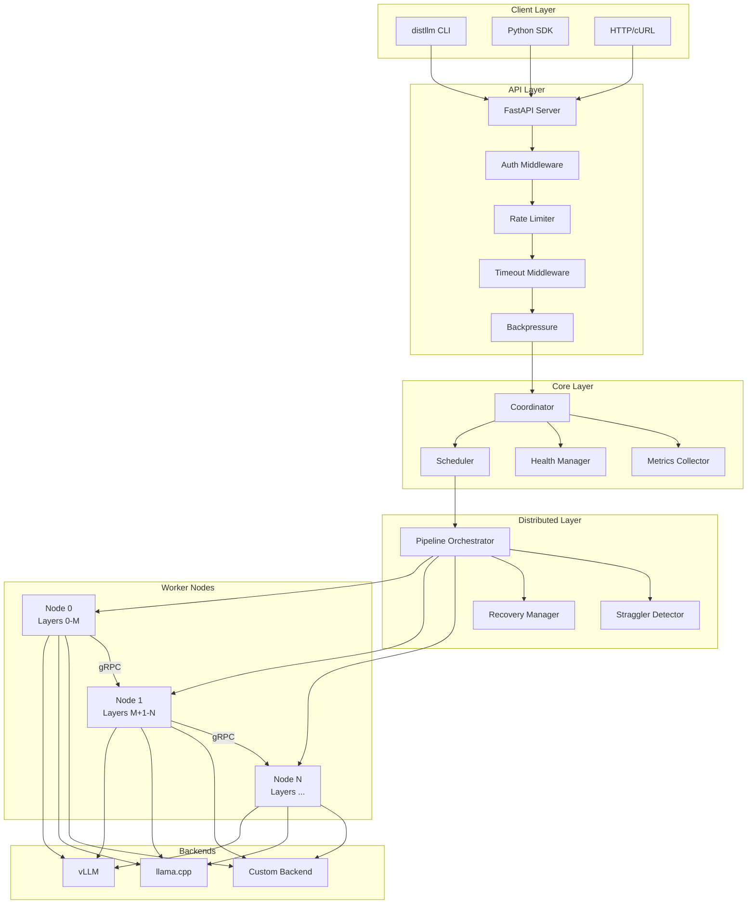

# Contributing to Distributed LLM

Thank you for your interest in contributing! This guide covers everything you need to set up a development environment, understand the project structure, and submit high-quality pull requests.

---

## Table of Contents

- [Development Environment Setup](#development-environment-setup)
- [Project Structure](#project-structure)
- [Running Tests](#running-tests)
- [Code Style Rules](#code-style-rules)
- [PR Workflow and Review Process](#pr-workflow-and-review-process)
- [How to Add a New Backend](#how-to-add-a-new-backend)
- [How to Add a New API Endpoint](#how-to-add-a-new-api-endpoint)
- [How to Add a New CLI Command](#how-to-add-a-new-cli-command)
- [Debugging Tips](#debugging-tips)
- [Common Development Workflows](#common-development-workflows)

---

## Development Environment Setup

### Prerequisites

- **Python 3.10+** (3.11 or 3.12 recommended)
- **Git**
- **CUDA 12.x** (for GPU development — optional for API-only work)
- **Docker** (for container builds — optional)

### Quick Start

```bash
# Clone the repository
git clone https://github.com/distributed-llm/distributed-llm.git
cd distributed-llm

# Create a virtual environment
python -m venv .venv
source .venv/bin/activate  # Linux/macOS
# .venv\Scripts\activate   # Windows

# Install in editable mode with dev dependencies
pip install -e ".[dev]"

# Install pre-commit hooks
pre-commit install
pre-commit install --hook-type pre-push
```

### GPU Development

For working on inference, model loading, or CUDA-related code:

```bash
# Install PyTorch with CUDA support first
pip install torch --index-url https://download.pytorch.org/whl/cu128

# Then install the package with self-hosted extras
pip install -e ".[dev,self-hosted]"
```

### Docker Development

```bash
# Build the image
docker build -t distributed-llm .

# Run with docker-compose (coordinator + 2 worker nodes)
docker-compose up

# GPU-enabled compose
docker-compose -f docker-compose.gpu.yml up
```

### Pre-commit Hooks

The project uses pre-commit hooks for automated quality checks:

```bash
# Install hooks (one-time)
make pre-commit-install

# Run manually on all files
make pre-commit-run
```

Hooks include: `detect-secrets`, `bandit`, `ruff` (lint + format), `mypy`, `yamllint`, and standard checks (trailing whitespace, merge conflicts, etc.).

---

## Project Structure

```
distributed-llm/
├── src/distllm/                  # Main package
│   ├── api/                      # FastAPI REST API
│   │   ├── routes/               # Endpoint routers (chat, completion, embeddings, health, admin)
│   │   ├── middleware.py          # Auth, request ID, rate limiting middleware
│   │   ├── errors.py             # Standardized error responses
│   │   ├── server.py             # FastAPI app factory, lifespan, middleware registration
│   │   └── streaming.py          # SSE streaming helpers
│   ├── backends/                 # Inference backends
│   │   ├── vllm_backend.py       # vLLM integration
│   │   └── llamacpp_backend.py   # llama.cpp integration
│   ├── cli/                      # Typer CLI commands
│   │   ├── main.py               # CLI app entry point
│   │   ├── chat.py               # `distllm chat` command
│   │   ├── run.py                # `distllm run` command
│   │   └── ...                   # Other commands (deploy, status, cert, etc.)
│   ├── config/                   # Pydantic settings
│   │   ├── settings.py           # DistLLMSettings root config
│   │   ├── _model.py             # Model-related settings
│   │   ├── _network.py           # Network/TLS settings
│   │   ├── loader.py             # YAML config loader
│   │   └── resolver.py           # Config precedence resolver
│   ├── core/                     # Core inference engine
│   │   ├── coordinator.py        # Inference orchestration
│   │   ├── cluster_manager.py    # Node discovery and health
│   │   ├── health_manager.py     # Health check logic
│   │   └── metrics_collector.py  # Prometheus metrics
│   ├── dist/                     # Distributed execution
│   │   ├── worker.py             # gRPC worker node server
│   │   ├── pipeline.py           # Pipeline parallelism orchestrator
│   │   ├── recovery.py           # Node failure recovery
│   │   └── straggler.py          # Straggler detection
│   ├── communication/            # gRPC layer
│   │   ├── node_pb2.py           # Generated protobuf code
│   │   └── node_pb2_grpc.py      # Generated gRPC stubs
│   ├── errors/                   # Domain exceptions
│   │   └── types.py              # DistLLMError hierarchy
│   ├── models/                   # Model loading and partitioning
│   │   └── partitioner.py        # Layer extraction and partitioning
│   ├── plugins/                  # Plugin system
│   │   └── builtin.py            # Built-in plugins (rate limit, audit, metrics)
│   ├── security/                 # TLS, certificates
│   └── observability/            # Tracing, logging, Prometheus exporter
├── proto/                        # Protobuf definitions
│   └── node.proto                # gRPC service definition
├── tests/                        # Test suite
│   ├── api/                      # API endpoint tests
│   ├── core/                     # Core engine tests
│   ├── dist/                     # Distributed system tests
│   ├── chaos/                    # Chaos engineering tests
│   ├── security/                 # Security tests
│   ├── benchmark/                # Performance benchmarks
│   └── conftest.py               # Shared fixtures
├── deploy/                       # Deployment configs
│   ├── kustomize/                # Kustomize overlays (dev, staging, production)
│   └── grafana/                  # Grafana dashboards
├── benchmarks/                   # Benchmark scripts
├── examples/                     # Usage examples
├── integrations/                 # Third-party integrations (LangChain, LlamaIndex, etc.)
├── extensions/                   # Editor extensions (VS Code)
├── docker-compose.yml            # Multi-node Docker setup
├── Dockerfile                    # Multi-stage CUDA build
├── Makefile                      # Common commands
├── pyproject.toml                # Package metadata and tool config
└── config.yaml                   # Default configuration
```

### Architecture Diagram



---

## Running Tests

### Test Categories

| Category | Command | Description |
|----------|---------|-------------|
| All tests | `pytest` | Full test suite |
| Unit only | `pytest -m "not integration and not e2e and not slow"` | Fast unit tests |
| Integration | `pytest -m integration` | Tests requiring multiple components |
| GPU tests | `pytest -m "not slow" tests/test_gpu.py` | GPU-specific tests |
| Chaos tests | `make chaos-test` | Resilience and failure injection |
| Load tests | `make load-test-chat` | Locust-based load testing |
| Security | `make security` | Bandit + safety + detect-secrets |
| Benchmarks | `make bench` | Performance benchmarks |

### Running Tests

```bash
# Full suite
pytest

# With coverage
make test-cov

# Specific test file
pytest tests/test_coordinator.py

# Specific test function
pytest tests/test_coordinator.py::test_inference_flow

# Run only fast tests
pytest -m "not slow and not integration"

# Run with verbose output and stop on first failure
pytest -x -v

# Run tests matching a pattern
pytest -k "test_health" -v
```

### Test Markers

Defined in `pytest.ini`:

| Marker | Purpose |
|--------|---------|
| `@pytest.mark.integration` | Integration tests |
| `@pytest.mark.e2e` | End-to-end tests |
| `@pytest.mark.slow` | Tests taking >10s |
| `@pytest.mark.chaos` | Chaos engineering tests |
| `@pytest.mark.benchmark` | Performance benchmarks |
| `@pytest.mark.security` | Security-focused tests |
| `@pytest.mark.property` | Property-based tests (hypothesis) |
| `@pytest.mark.sdk` | SDK client tests |
| `@pytest.mark.cli` | CLI command tests |

### Writing Tests

```python
import pytest
from distllm.core.coordinator import Coordinator

@pytest.mark.integration
async def test_coordinator_handles_request(coordinator_fixture):
    """Test that coordinator routes inference correctly."""
    result = await coordinator_fixture.inference("Hello")
    assert result.tokens_generated > 0
    assert result.latency_ms < 5000
```

---

## Code Style Rules

### Formatting and Linting

- **Ruff** for linting (configured in `pyproject.toml`)
- **Ruff-format** for formatting (replaces Black)
- **mypy** for type checking (strict mode for core modules)

```bash
# Lint
make lint

# Format
make format

# Type check
mypy src/distllm/
```

### Naming Conventions

| Element | Convention | Example |
|---------|-----------|---------|
| Variables | `snake_case` | `node_count`, `is_ready` |
| Functions | `snake_case` | `get_health_status()` |
| Classes | `PascalCase` | `Coordinator`, `PipelineOrchestrator` |
| Constants | `UPPER_SNAKE_CASE` | `MAX_RETRIES`, `DEFAULT_TIMEOUT` |
| Private methods | `_leading_underscore` | `_validate_config()` |
| Booleans | `is_`/`has_`/`can_` prefix | `is_healthy`, `has_gpu` |

### Code Patterns

**Type hints on all new code:**
```python
def get_node_status(node_id: str) -> NodeStatus:
    """Return the current status of a worker node."""
    ...
```

**Use domain exceptions:**
```python
from distllm.errors.types import NodeUnreachableError, ModelLoadError

# Good
raise NodeUnreachableError(f"Node {node_id} is not responding")

# Bad
raise Exception("Node not responding")
```

**Use `loguru.logger` instead of `print()`:**
```python
from loguru import logger

logger.info("Starting inference", model=model_name, tokens=max_tokens)
logger.error("Node failed", node_id=node_id, error=str(e))
```

**Prefer frozen dataclasses for config:**
```python
from dataclasses import dataclass

@dataclass(frozen=True)
class RetryConfig:
    max_retries: int = 3
    backoff_base: float = 1.0
    backoff_max: float = 30.0
```

**Return new objects instead of mutating:**
```python
# Good
def add_node(nodes: list[Node], new_node: Node) -> list[Node]:
    return [*nodes, new_node]

# Bad
def add_node(nodes: list[Node], new_node: Node) -> None:
    nodes.append(new_node)
```

### Import Order

```python
# 1. Standard library
import asyncio
import os
from collections import defaultdict

# 2. Third-party
from fastapi import FastAPI
from loguru import logger
import torch

# 3. Local
from distllm.core.coordinator import Coordinator
from distllm.config.settings import DistLLMSettings
```

### File Organization

- One class per file when possible
- Module docstring at top of every file
- `__all__` exports in `__init__.py` files
- Follow existing patterns — look at neighboring files before writing new code

---

## PR Workflow and Review Process

### Branch Naming

```
feat/add-llama3-support
fix/grpc-timeout-race-condition
perf/optimize-kv-cache-eviction
docs/update-deployment-guide
refactor/extract-rate-limiter
```

### Commit Convention

```
<type>: <short summary>

<optional body>
```

| Type | When to Use |
|------|-------------|
| `feat:` | New features |
| `fix:` | Bug fixes |
| `perf:` | Performance improvements |
| `docs:` | Documentation changes |
| `test:` | Test additions/changes |
| `refactor:` | Code refactoring (no behavior change) |
| `ci:` | CI/CD changes |
| `chore:` | Maintenance tasks |

### PR Checklist

Before submitting:

1. **Run the full test suite:** `make test`
2. **Run the linter:** `make lint`
3. **Format code:** `make format`
4. **Test locally** with at least one model (TinyStories-1M is fastest)
5. **Update CHANGELOG.md** with your changes
6. **Write tests** for new functionality (aim for >80% coverage)
7. **Update docs** if behavior changes

### Review Process

1. Open a PR against `main`
2. CI runs automatically (tests, lint, type check)
3. A maintainer reviews the code
4. Address feedback (push new commits, don't force-push during review)
5. Once approved, a maintainer merges

### PR Template

The repository includes a PR template at `.github/pull_request_template.md`. Fill in all sections.

---

## How to Add a New Backend

Backends are inference engines that run model layers on hardware (GPU, CPU, etc.).

### 1. Create the Backend Module

```python
# src/distllm/backends/my_backend.py

from distllm.backends.base import BaseBackend

class MyBackend(BaseBackend):
    """My custom inference backend."""

    def __init__(self, model_name: str, device: str, **kwargs):
        super().__init__(model_name, device)
        self.model = self._load_model()

    def _load_model(self):
        """Load and initialize the model."""
        ...

    async def forward(self, hidden_states, attention_mask, **kwargs):
        """Run a forward pass through the model layers."""
        ...

    def get_memory_usage(self) -> dict:
        """Return current GPU/memory usage."""
        ...
```

### 2. Add Configuration

```python
# src/distllm/config/_backends.py

class MyBackendSettings(BaseModel):
    enabled: bool = False
    custom_param: int = 42
```

Add to `DistLLMSettings` in `settings.py`:
```python
my_backend: MyBackendSettings = Field(default_factory=MyBackendSettings)
```

### 3. Register the Backend

Update the backend factory in `src/distllm/backends/__init__.py` to recognize your backend.

### 4. Add Tests

```python
# tests/backends/test_my_backend.py

import pytest

@pytest.mark.integration
def test_my_backend_inference():
    backend = MyBackend("test-model", "cpu")
    result = await backend.forward(...)
    assert result is not None
```

### 5. Update Documentation

- Add to `docs/MODEL_COMPATIBILITY.md` if applicable
- Update `config.yaml` with example configuration
- Add to `README.md` backend list

---

## How to Add a New API Endpoint

### 1. Create a Route Module

```python
# src/distllm/api/routes/my_feature.py

from fastapi import APIRouter, Depends
from pydantic import BaseModel

router = APIRouter(prefix="/v1/my-feature", tags=["my-feature"])

class MyRequest(BaseModel):
    input: str
    param: int = 10

class MyResponse(BaseModel):
    result: str
    metadata: dict

@router.post("/", response_model=MyResponse)
async def my_endpoint(request: MyRequest):
    """My custom endpoint."""
    result = process(request.input, request.param)
    return MyResponse(result=result, metadata={"version": "1.0"})
```

### 2. Register the Router

In `src/distllm/api/server.py`, add your router:

```python
from distllm.api.routes.my_feature import router as my_feature_router

# In the app setup:
app.include_router(my_feature_router)
```

Also add the export to `src/distllm/api/routes/__init__.py`.

### 3. Add Middleware (if needed)

For auth, rate limiting, or timeouts, the existing middleware applies automatically. For custom middleware, add it in `server.py`.

### 4. Add Tests

```python
# tests/api/test_my_feature.py

import pytest
from httpx import AsyncClient

@pytest.mark.integration
async def test_my_endpoint(client: AsyncClient):
    response = await client.post("/v1/my-feature/", json={
        "input": "test",
        "param": 5
    })
    assert response.status_code == 200
    data = response.json()
    assert "result" in data
```

### 5. Update API Documentation

- Add to `docs/api.md`
- Add to `docs/API_CHANGELOG.md` under the current version

---

## How to Add a New CLI Command

### 1. Create the Command Module

```python
# src/distllm/cli/my_command.py

import typer
from rich.console import Console

app = typer.Typer(help="My custom command group.")
console = Console()

@app.command("do-thing")
def do_thing(
    name: str = typer.Argument(..., help="Name of the thing"),
    verbose: bool = typer.Option(False, "--verbose", "-v", help="Verbose output"),
) -> None:
    """Do something useful with a thing."""
    if verbose:
        console.print(f"Processing {name}...")
    result = process(name)
    console.print(f"[green]Done:[/green] {result}")
```

### 2. Register the Command

In `src/distllm/cli/main.py`, add the sub-app:

```python
from distllm.cli.my_command import app as my_command_app

app.add_typer(my_command_app, name="my-command")
```

### 3. Add Tests

```python
# tests/cli/test_my_command.py

import pytest
from typer.testing import CliRunner
from distllm.cli.main import app

runner = CliRunner()

@pytest.mark.cli
def test_do_thing():
    result = runner.invoke(app, ["my-command", "do-thing", "test"])
    assert result.exit_code == 0
    assert "Done" in result.output
```

### 4. Update Help

The CLI auto-generates help from docstrings. Run `distllm --help` to verify your command appears.

---

## Debugging Tips

### Local Single-Node Mode

The fastest way to test changes:

```bash
# Run in local mode (no distributed setup needed)
distllm --model roneneldan/TinyStories-1M --local --chat

# Run the API server locally
distllm-api --model roneneldan/TinyStories-1M --local --port 8000
```

### Debug Logging

```bash
# Enable debug logging
DISTLLM_LOG_LEVEL=DEBUG distllm-api --model roneneldan/TinyStories-1M --local

# Or in config.yaml
logging:
  level: "DEBUG"
  format: "json"
```

### Debug Mode API Endpoint

```bash
# Start with debug mode enabled
distllm-api --model roneneldan/TinyStories-1M --local --debug

# View recent requests
curl http://localhost:8000/v1/debug/recent
```

### gRPC Debugging

```bash
# Enable gRPC debug logging
GRPC_VERBOSITY=DEBUG GRPC_TRACE=all distllm-node --model roneneldan/TinyStories-1M --local
```

### Profiling

```bash
# Memory profiling
make memory-profile

# CPU profiling with cProfile
python -m cProfile -o profile.stats src/distllm/api/server.py --model roneneldan/TinyStories-1M --local

# Analyze with snakeviz
pip install snakeviz
snakeviz profile.stats
```

### Common Issues

| Problem | Solution |
|---------|----------|
| `CUDA out of memory` | Use a smaller model or reduce `gpu_memory_utilization` in config |
| `Port already in use` | Kill the process: `lsof -i :8000` or change `--port` |
| `ModuleNotFoundError` | Ensure you installed with `pip install -e ".[dev]"` |
| `protobuf mismatch` | Regenerate: `make proto` |
| Tests hang | Check for unclosed gRPC channels; use `pytest --timeout=30` |

---

## Common Development Workflows

### Feature Development

```bash
# 1. Create branch
git checkout -b feat/my-feature

# 2. Make changes and test iteratively
pytest tests/test_my_feature.py -v

# 3. Lint and format
make lint format

# 4. Run full suite
make test

# 5. Commit and push
git add .
git commit -m "feat: add my feature"
git push origin feat/my-feature
```

### Bug Fix

```bash
# 1. Write a failing test first
# tests/test_bug.py

# 2. Run it to confirm it fails
pytest tests/test_bug.py -v

# 3. Fix the code

# 4. Run test again to confirm it passes
pytest tests/test_bug.py -v

# 5. Run full suite
make test
```

### Adding Model Support

```bash
# 1. Check model architecture
python -c "from transformers import AutoConfig; print(AutoConfig.from_pretrained('model-name'))"

# 2. Update partitioner if needed
# src/distllm/models/partitioner.py

# 3. Test with the model
distllm --model model-name --local --chat

# 4. Add to model compatibility matrix
# docs/MODEL_COMPATIBILITY.md
```

### Working with Protobuf

```bash
# After editing proto/node.proto
make proto

# Verify generated files
ls src/distllm/communication/node_pb2*.py
```

### Docker Workflow

```bash
# Build and test
docker build -t distributed-llm:test .
docker run --rm distributed-llm:test distllm --help

# Full multi-node test
docker-compose up --build

# GPU test
docker-compose -f docker-compose.gpu.yml up --build
```

### Benchmark Before/After

```bash
# Run baseline benchmark
python benchmarks/run.py --model roneneldan/TinyStories-1M --output before.json

# Make your changes

# Run comparison benchmark
python benchmarks/run.py --model roneneldan/TinyStories-1M --output after.json

# Compare
python benchmarks/compare.py before.json after.json
```

---

## First-Time Contributors

Good starting issues:
- Issues labeled [`good first issue`](https://github.com/distributed-llm/distributed-llm/labels/good%20first%20issue)
- Adding support for new model architectures
- Writing tests for existing code
- Performance benchmarks
- Documentation improvements

## Questions?

Open a [GitHub Discussion](https://github.com/distributed-llm/distributed-llm/discussions) or ask in an issue. We're happy to help!
