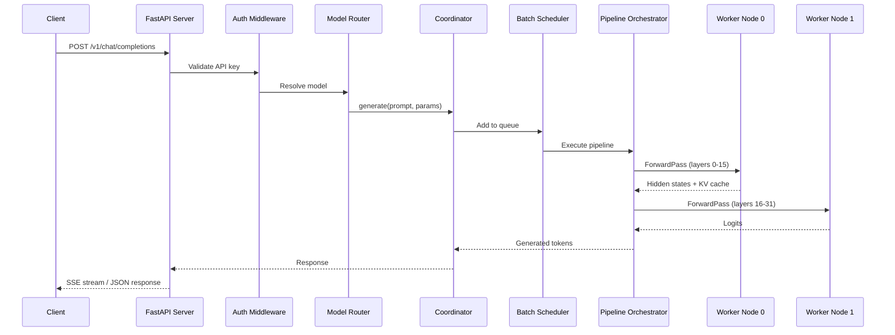
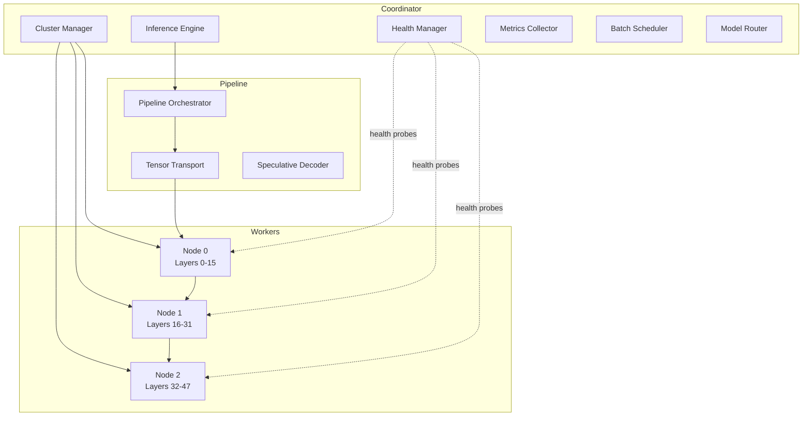
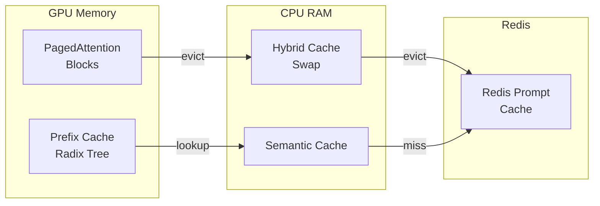
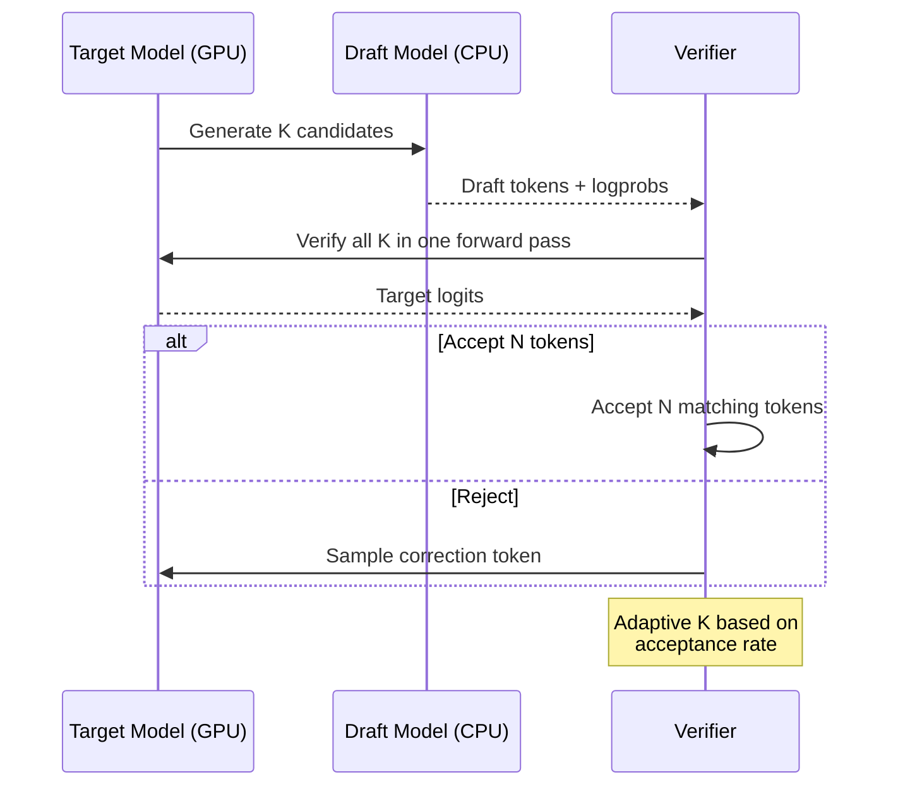
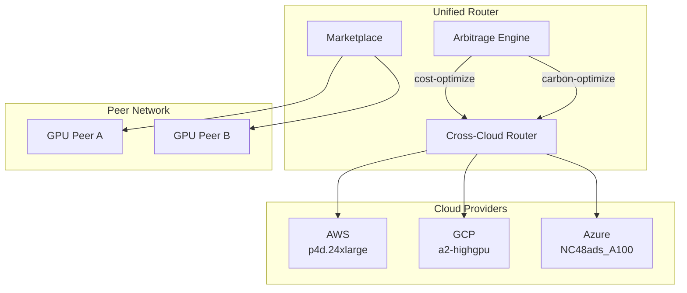
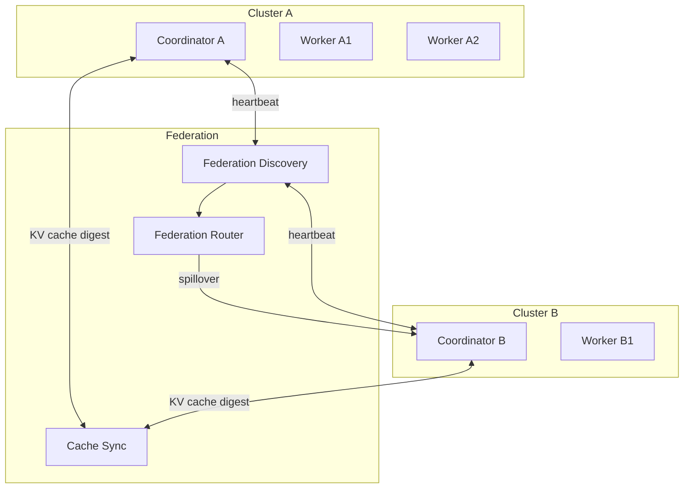
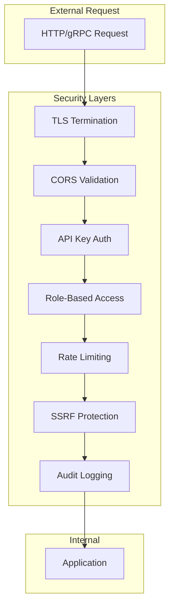
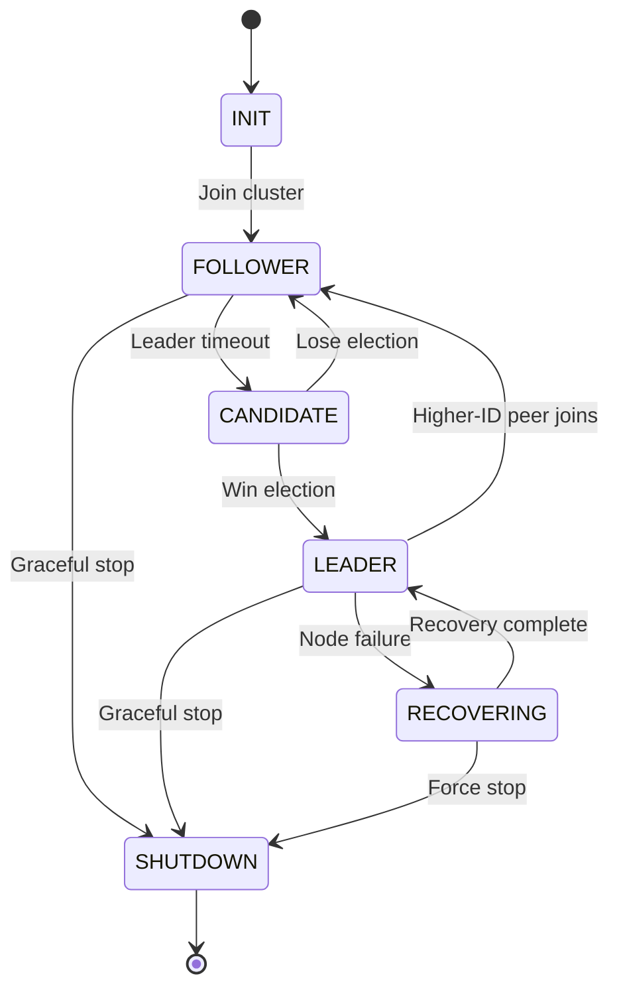
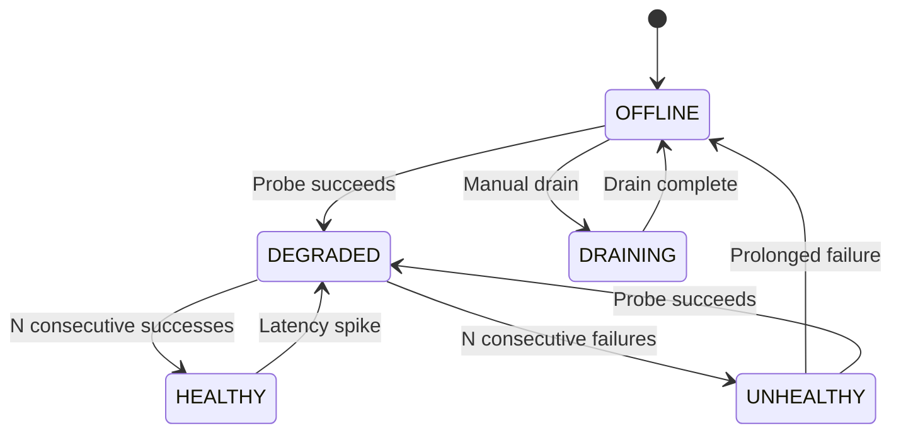

# Architecture Diagrams

Mermaid diagrams for DistLLM's internal architecture. These complement
the textual description in [ARCHITECTURE.md](ARCHITECTURE.md).

---

## Request Flow

## Coordinator Architecture

## KV Cache Hierarchy

## Speculative Decoding Flow

## Multi-Cloud Routing

## Federation Architecture

## Security Layers

## State Machine: Node Lifecycle

## State Machine: Node Health

