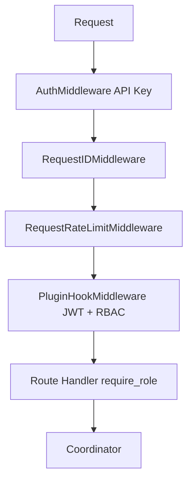

---
tags:
  - api
  - fastapi
---
# API Server

**Location:** `src/distllm/api/` — **1.1 MB, ~40 files**

**Commands:** `python -m pytest tests/api/ -v`

## Route Files (17)
`chat.py`, `completion.py`, `embeddings.py`, `health.py`, `admin.py`, `model_registry.py`, `defrag.py`, `exchange.py`, `federated.py`, `gossip.py`, `batch.py`, `debug.py`, `plugins.py`, `router_admin.py`, `scheduler.py`, `leaderboard.py`, `marketplace.py`, `webrtc.py`, `prompts.py`

## Middleware Stack

## Security
- AuthMiddleware: API key from `Authorization: Bearer` header
- Rate limiter: counts failed attempts only (not successful)
- JWT: wired end-to-end via `_auth_header` in plugin context
- RBAC: `require_role()` on every protected route
- OAuth2: state parameter stored server-side, validated on callback
- OIDC: nonce parameter for replay protection

## Dependencies → [[docs/_map/01 Core Engine]]

## Recent Work
- ✅ JWT auth wired end-to-end (was dead code)
- ✅ OAuth2 state + OIDC nonce CSRF protection
- ✅ Role-based access on ALL /api/* routes
- ✅ Cluster key rotation with 5-minute grace period
- ✅ HA state snapshot endpoint `/api/v1/ha/snapshot`
- ✅ Unified error messages (no "missing" vs "invalid")
- ✅ Dead code removed (`server_middleware.py`, `rate_limit_middleware.py`)
