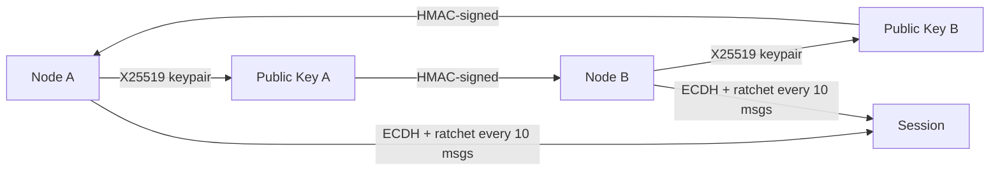

---
tags:
  - security
---
# Security

**Location:** `src/distllm/security/` — **72 KB, 3 files**

## Key Files
| File | Purpose |
|------|---------|
| `e2e.py` | E2E encryption (X25519 + XSalsa20-Poly1305) with ratchet forward secrecy |
| `log_redaction.py` | Sensitive data redaction in logs |
| `utils.py` | Cryptographic utilities |

## E2E Encrypt Flow

## Related
- [[docs/_map/03 API Server]] — Auth middleware, SSO
- [[docs/_map/01 Core Engine]] — Cert rotation, secret manager
