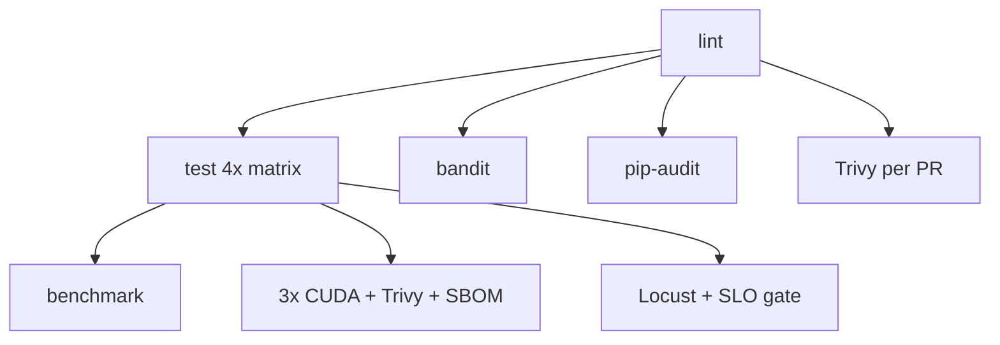

---
tags:
  - infra
  - ci
  - docker
---
# Infrastructure

**Location:** Root + `deploy/` + `benchmarks/` + `docs/` + `.github/` — **~0.5 MB**

## CI Pipeline (15 jobs)

## Key Configs
| File | Purpose |
|------|---------|
| `Dockerfile` | Main image (CUDA 12.8, multi-stage) |
| `.github/workflows/ci.yml` | CI pipeline |
| `.github/workflows/release.yml` | Release pipeline |
| `.github/workflows/nightly-benchmark.yml` | Nightly benchmarks (NEW) |
| `.github/workflows/nightly-loadtest.yml` | Nightly load tests (NEW) |
| `.github/dependabot.yml` | Auto-updates (NEW) |
| `.pre-commit-config.yaml` | Pre-commit hooks w/ pip-audit |
| `benchmarks/Dockerfile` | Benchmark environment (NEW) |
| `docs/BENCHMARKS.md` | Benchmark methodology (NEW) |

## Coverage: 80% (unified across CI, release, pyproject.toml)

## Recent Work
- ✅ Dependabot for pip + GitHub Actions
- ✅ Nightly benchmark + load test pipelines
- ✅ Container security scanning on every PR
- ✅ Coverage thresholds unified at 80%
- ✅ Trivy pinned to `0.29.0`
- ✅ pip-audit in pre-commit
- ✅ Auth bypass fuzz test (81 parametrized cases)
