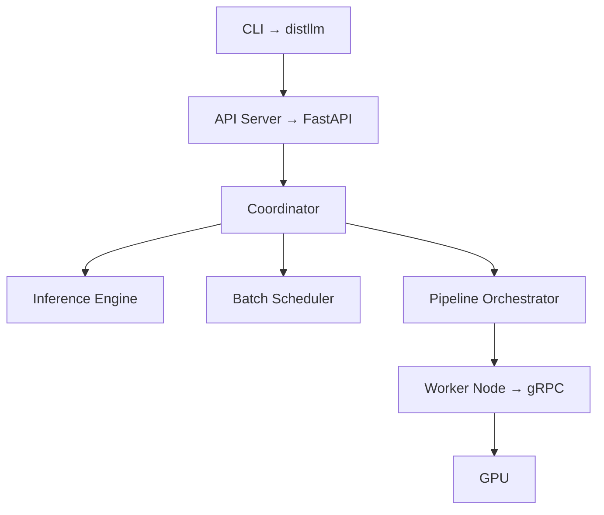

---
tags:
  - meta
  - root
---
# DistLLM — Distributed LLM Inference Engine

**Version:** 0.4.1 | **Python:** >= 3.10 | **Line Count:** ~126,921 | **License:** Apache-2.0

## What It Is
Pool GPUs across multiple devices (RTX 4090s, laptops, cloud instances) to run LLMs no single machine can handle. Pipeline parallelism over ordinary networking.

## Architecture

## Module Map
| Module | Size | Purpose | [[Link]] |
|--------|------|---------|----------|
| `src/distllm/core/` | 5.4 MB | Engine, scheduler, KV cache, speculative decoding | [[docs/_map/01 Core Engine]] |
| `src/distllm/dist/` | 4.0 MB | Pipeline, partitioning, federation, straggler | [[docs/_map/02 Distributed Layer]] |
| `src/distllm/api/` | 1.1 MB | FastAPI server, routes, auth, SSO | [[docs/_map/03 API Server]] |
| `src/distllm/cli/ + config/` | 0.9 MB | CLI commands, config management | [[docs/_map/04 CLI & Config]] |
| `src/distllm/backends/ + models/` | 0.6 MB | Inference backends, model partitioning | [[docs/_map/05 Backends & Models]] |
| `src/distllm/security/` | 72 KB | E2E encryption, log redaction | [[docs/_map/06 Security]] |
| `integrations/ + sdk/` | ~2 MB | Framework integrations + multi-language SDKs | [[docs/_map/07 Integrations]] |
| `tauri/ + website/ + extensions/` | ~3 MB | Desktop app, marketing site, VS Code | [[docs/_map/08 Frontends]] |
| Root + `deploy/ + benchmarks/ + .github/` | ~0.5 MB | Docker, CI/CD, docs, benchmarks | [[docs/_map/09 Infrastructure]] |
| `tests/` | ~5 MB | All tests (300+ files) | [[docs/_map/10 Tests]] |

## Recent Work (80+ fixes/features)
- **[CRITICAL]** Security: JWT, OAuth, SAML, auth bypass — all patched
- **[Performance]** 1F1B micro-batch pipeline, pre-allocated buffers, mem-bandwidth-bound model
- **[Advanced]** Self-speculation, FSDP sharding, multi-draft decoding, HA replication
- **[Infra]** Dependabot, nightly benchmarks/loadtests, auth fuzzing, pip-audit pre-commit
- **[Docs]** Benchmark methodology, Tauri setup guide, Obsidian project map
